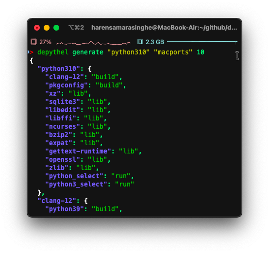
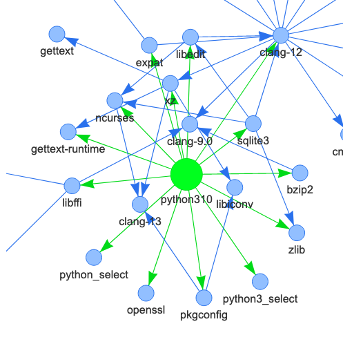

About
~~~~~~~~~~~~~~~~~~~~~~~~~~~~~~~~~~~~~~~~~~~~~~~~~~~~~~~~~~~~~~~~~~~~~~~~~~~~~~~~~~~~~~~~~~~~~~~~~~~~~~~~~~~~~~~~~~~~~~~

|generate-image| |visualise-image|

**depythel** is a series of open-source pure Python tools to help you manage dependencies in a variety of different projects.

It aims to provide a visual solution to your dependency woes, helping you to make informed judgements about how to
manage your project distribution.

Installation
-----------------------------------------------------------------------------------------------------------------------

PyPi
***********************************************************************************************************************

.. code-block:: console

    $ pip install depythel

License
-----------------------------------------------------------------------------------------------------------------------

This project is `free software <https://www.gnu.org/philosophy/free-sw.en.html>`_, and it will always stay free.

We respect the `essential freedoms <https://www.gnu.org/philosophy/free-sw.en.html#four-freedoms>`_ of our users, and
so both the API and the CLT are openly licensed under
`GPL-3.0-or-later <https://github.com/harens/depythel/blob/master/LICENSE>`_.

In the same sense, the project's extensive documentation is freely licensed under the `GNU Free Documentation License
v1.3 or later <https://www.gnu.org/licenses/fdl-1.3.html>`_.
