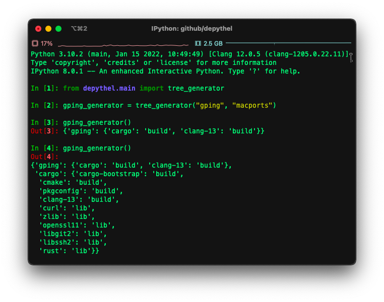

About
~~~~~~~~~~~~~~~~~~~~~~~~~~~~~~~~~~~~~~~~~~~~~~~~~~~~~~~~~~~~~~~~~~~~~~~~~~~~~~~~~~~~~~~~~~~~~~~~~~~~~~~~~~~~~~~~~~~~~~~

**depythel API** is an open-source pure Python API tool to help manage dependencies in a variety of different projects.

Use this tool if you like the standard depythel CLT, but don't want the extra baggage that comes with a command line tool.

Benefits
-----------------------------------------------------------------------------------------------------------------------

- 🎉 No third party dependencies
- 🐍 Compatible with all `supported Python versions <https://endoflife.date/python>`_ (3.7+)
- 👀 `PEP 561 compatible <https://www.python.org/dev/peps/pep-0561>`_, with built in support for type checking

Install
-----------------------------------------------------------------------------------------------------------------------

.. code-block:: console

    $ pip install depythel-api

License
-----------------------------------------------------------------------------------------------------------------------

The depythel API is `free software <https://www.gnu.org/philosophy/free-sw.en.html>`_, and it will always stay free.

We respect the `essential freedoms <https://www.gnu.org/philosophy/free-sw.en.html#four-freedoms>`_ of our users, and
so depythel is openly licensed under `GPL-3.0-or-later <https://github.com/harens/depythel/blob/master/LICENSE>`_.
