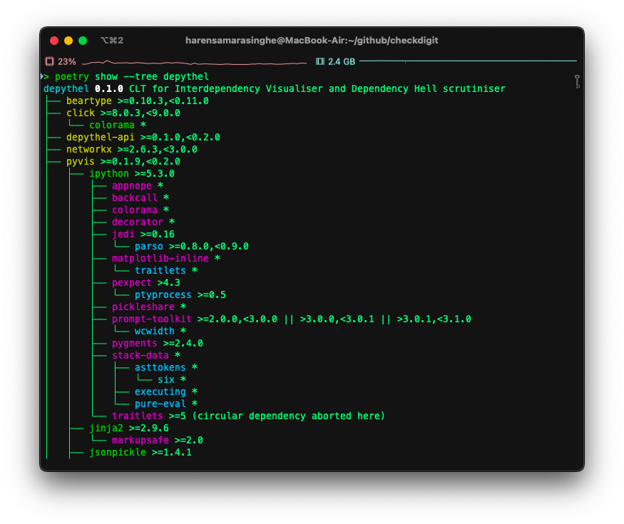
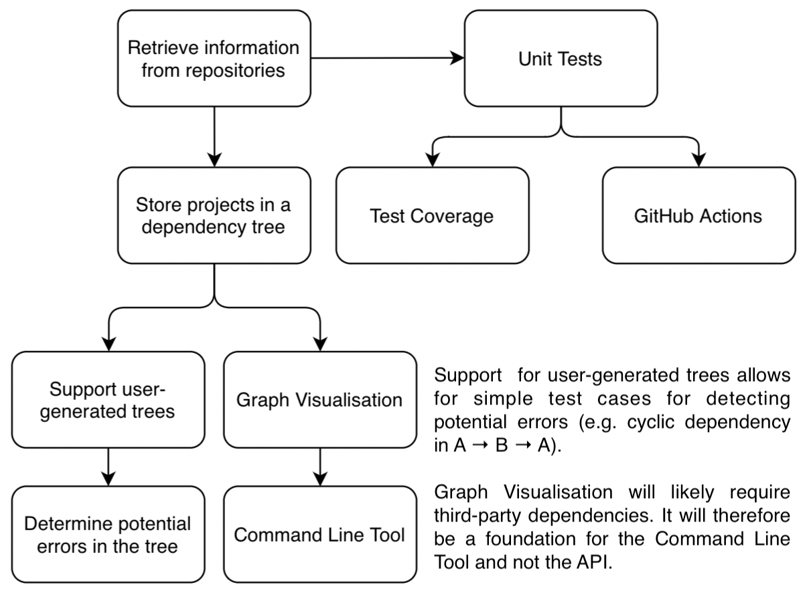

Analysis
=======================================================================================================================

Problem Area
-----------------------------------------------------------------------------------------------------------------------

Dependency resolution is a particularly important consideration in package management and distribution. Users simply
want programs to build and run as expected, and build failures due to conflicting dependencies can cause them a great
frustration. Not only does it waste the user's time, but also that of the maintainers, since they are then required to
deal with the resulting issue ticket requests.

An example of this is from the open-source text editor `lite-xl <https://lite-xl.github.io/>`_, which this document was
(partly) written in. Some users were `having trouble with its lua dependency <https://github.com/lite-xl/lite-xl/issues/3>`_,
since it specifically required version 5.2. It would then fail to build if it wasn't found:

.. code-block:: console

    meson.build:7:0: ERROR: Dependency "lua5.2" not found, tried pkgconfig, framework and cmake

Another example of dependency conflicts are circular dependencies. If dependency *A* depends on *B*, and *B* depends on
*A*, this can cause errors during buildtime. Alternatively, maybe there are so many dependencies, that the user is fed
up of waiting for them to finish downloading.

This problem area is something most developers don't even think about. As important as developing a good project is,
it's arguably even more useful to make sure that users can even run it in the first place. That's where depythel comes
in.

Client/End User
-----------------------------------------------------------------------------------------------------------------------

The majority of existing implementations for dependency resolution are end user orientated. As an example, package
managers will alert the user when a project fails to build.

depythel will instead take the approach of focusing on the developer, and acting as an easy-to-use continuous testing
tool. It will be developed as a Python API first, so that programmers can configure the tool as they see fit. This would
require a higher level of expertise in the area, and so for more novice users, a pre-configured command line tool will
also be provided. This can then be easily integrated into existing workflows.

As a project member of `MacPorts <https://www.macports.org/>`_, a package manager for macOS founded by a number of Apple
employees in 2002, I thought that I would ask some other members what their thoughts were on the potential of this tool.
This is since they would have experience dealing with dependency conflicts, and I wanted to know whether they thought
depythel would be a useful aide.

One of them noted its similarities to the foundations of a package manager. They liked the idea of being
able to visualise the dependencies, which is something they thought was quite novel.

Another person emphasised the need for thorough documentation of the API. They said that it would be useful if the API
could be provided separately to the CLT, so that developers don't have to download both if they only require the API.

Research methodology
-----------------------------------------------------------------------------------------------------------------------

The idea to choose a dependency conflict management project came from my experience in package managers. At MacPorts,
one of the issues we face is how to deal with things such as
circular dependencies. A language-agnostic tool to check for this would therefore be very beneficial. As a result, part
of my research comes from real world experience with trying to deal with this problem on a platform with thousands of
users.

I also did some online research on existing solutions for dependency conflicts, and determined some of their advantages
and drawbacks:

Poetry
+++++++++++++++++++++++++++++++++++++++++++++++++++++++++++++++++++++++++++++++++++++++++++++++++++++++++++++++++++++++

`Poetry <https://python-poetry.org/>`_ is a Python package manager, which depythel ironically uses itself behind the
scenes to manage its own dependencies. If there exists a solution to a dependency conflict, it will find it. In this regard, it
is a much more stable and polished tool than depythel.

However, it is Python-specific, whilst depythel aims to support a variety of languages and package managers in a
simple, modular fashion. Poetry is also a general package manager, and doesn't focus specifically on aspects like
dependency visualisation. In this regard, if all you're looking for is generic dependency management, depythel aims to be a more apt tool.

    The dependency tree of depythel CLT, generated via poetry.

System Package Managers
+++++++++++++++++++++++++++++++++++++++++++++++++++++++++++++++++++++++++++++++++++++++++++++++++++++++++++++++++++++++

Virtually all mature package managers provide some form of dependency conflict management. They are then able
to warn you as the user why it was not able to install a program.

depythel aims instead to be a tool predominantly for developers, rather than the end user. As such, it's built in such
a way to allow configurability and easy adoption into workflows.

Visualisation Tools
+++++++++++++++++++++++++++++++++++++++++++++++++++++++++++++++++++++++++++++++++++++++++++++++++++++++++++++++++++++++

.. figure:: https://raw.githubusercontent.com/naiquevin/pipdeptree/master/docs/twine-pdt.png

   Visualising the dependency tree of a project using ``pipdeptree``.

Visualisation tools, such as the one present in the `Haskell Tool Stack
<https://docs.haskellstack.org/en/stable/dependency_visualization/>`_, provide a visual way of showing a developer the
dependencies of their project.

With minor exceptions, like `pipdeptree <https://github.com/naiquevin/pipdeptree>`_, they don't normally warn the user
or errors in the dependency tree itself. They also usually support only one language. Depythel aims to not only warn of
potential misconfigurations, but also to support a variety of online language repos.

Features of proposed solution
-----------------------------------------------------------------------------------------------------------------------

The user will be able to install the API or the CLT (or both) via PyPi. Upon running the CLT, they will be greeted
with a colourful help message giving a basic overview of the subcommands. If they choose to generate a dependency tree,
a formatted JSON/text response will be returned. Alternatively, they will be able to enter their own tree and run methods
on that.

An interactive output will be generated for a given tree if the user specifies. They will be able to "pipe" any JSON output
to a file/other commands if they so desire for further management by other tools.

The API will be importable via the console. It will have no dependencies, allowing users to download the source
code directly and run it if they want. It will provide a ``Tree`` class to store either a user-generated or
repo-generated tree, and will provide methods such as cycle checking and topological sorting to act on them.

Critical Path
-----------------------------------------------------------------------------------------------------------------------

Although many of the tasks can be carried out in conjunction with each other, some tasks need to be completed before
others can begin. The diagram shows a critical path with a general overview of the jobs to complete.

   An outline of what order the tasks need to be completed as part of the critical path.

Initialising the repository modules is especially important since it provides the foundation for building the
dependency tree. Following this, various tree-orientated functionality can be written.

The command line tool acts as a frontend for the API, and so can only be implemented following the API's completion.

Throughout the process, unit tests should be written to ensure that the code base works as expected.

Requirements specification
-----------------------------------------------------------------------------------------------------------------------

#. API

    #. User-orientated

        #. The API must function on all `supported python versions <https://endoflife.date/python>`_. As of the time of
           writing, this is Python 3.7 up to 3.10.

            * This allows more people to be able to run depythel, helping to make it more accessible.

        #. There must be help documentation available for all public modules and attributes.

            * This helps to make depythel easier to use. Without adequate documentation, it would be difficult for new users
              to use depythel effectively.

        #. The module must comply with `PEP 561 - Distributing and Packaging Type Information <https://peps.python.org/pep-0561/>`_.

            #. depythel should be fully type-checked, and the types of various attributes/parameters/etc. should be
               available to the user. This can then be used by autocomplete tools such as PyCharm.

            #. Its compliance can be checked using `mypy <http://mypy-lang.org>`_. It will be a success if there are no
               errors after running ``mypy --strict`` on the code base.

        #. It must be installable via PyPi.

            * The user should be able to install the API easily without having to fetch dependencies and build from source.

    #. Functionality

        #. No third-party dependencies should be required during runtime.
  
            * There are all sorts of potential security risks from this, since we don't own the code. However, if
              this API is going to be used by other developers, it needs to be suitably stable and battle tested. [1]_

            * Security is a particularly important consideration for tools that manage dependencies. See :ref:`System Security and Integrity of Data`
              for more information.  

            * On a separate note, the command line tool is more likely to be used in less security-intensive environments.
              For this reason, and to help reduce development costs, this policy will not be enforced for the CLT.

        To be a success, the modules below should pass a series of fabricated scenarios via unit testing.

        #. It must be able to detect cycles in a dependency tree.

            * If *A* and *B* are dependencies, and *A requires B* to build and vice versa, that's going to break during
              buildtime.

            * depythel aims to detect errors in dependency trees. Since trees are acyclic, cycles count as an error.

            * Out of all the features of the proposed solution, this one is likely to be one of the most time
              consuming. This is since circular dependencies break the standard layout of a dependency tree. However,
              it should still be feasible.

        #. It must be able to perform topological sorting.

            * Dependency trees are normally used to determine what dependencies to install when building a project.
              depythel should be able to determine the correct order to install these dependencies.

        #. depythel must be able to retrieve information from at least three different online repositories.

            * Dependency hell can occur in a variety of different environments. depythel should therefore be able
              to work with different repos (e.g. MacPorts, NPM, etc.)

            * This is especially important, since the majority of existing implementations only support one repository/language.

            "Dependency hell is not technology specific either. I've run into it in the Ruby/Rails ecosystem, in the Clojure
            ecosystem, and in the NodeJS ecosystem. I know folks who have run into it in C++ and Python, too. You name the \
            language, operating system, framework...it's going to happen."

            -- `John Bintz, Software Engineer at Tidelift
            <https://dev.to/tidelift/dependency-hell-is-inevitable-and-that-s-ok-and-you-re-ok-too-5594>`_

            * Modular language support is not only important as a USP for depythel, but also since Dependency Hell can happen
              in any language.

        #. User-generated trees should be able to use the same modules as trees from online repositories.

            * As part of the API, a third-party developer might want to run the depythel modules on custom dependency trees.

            * This feature also allows for depythel to work without internet access, which is useful for reproducibility.

            * The user should be able to enter their own tree in as part of both the CLT and the API. The majority of depythel modules
              should then function as if the online repositories were used.

        #. There must be some form of dependency visualisation available.

            * This might be in the form of parsable JSON output (or some other format). The added benefit of this is that the
              end user can then use the data more efficiently compared to an image.

        #. Large dependency trees should have additional fallbacks in place.

            * In reality, dependency trees for large projects can be extremely large and take a long time to generate. Measures
              should be in place to account for this. This should include:

            * Generate dependency trees to a depth specified by the user

                * The user might only be interested in the first few dependencies. Too many projects in a tree can make it
                  hard to extract information from it.

            * Support for caching

                * For large projects, cycles are likely to occur. Instead of refetching information about a project from the
                  online repository, some basic caching can speed up the tree generation.

                * Reducing the number of API calls also helps to reduce the strain on the servers of the online repositories.

                * Efficient solutions exist natively in Python, such as from ``functools.cache``. It therefore seems unnecessary
                  to reinvent the wheel and implement a custom caching function.

                * It should be client-side caching and not server-side since the data is not deterministic. Dependencies can be
                  updated frequently and so it would not be wise to cache incorrect information in a database.

#. Command Line Tool

    Although the Python API is being developed first, a command line tool should still be available for general
    usage. This is especially important for continuous testing integration, where a CLT can be easily added.

    #. It should provide at least the same feature set as the API.

        * Although the CLT is designed with more novice users in mind, it should not be a watered down version of the API.
          They should both have the same core functionality.

    #. Similar to the API, some form of dependency visualisation should be available.

        * For the CLT, where the end users are less experienced, an interactive tree might be a more beneficial form of
          visualisation.

        * To be a success, there should be at least two forms of possible output available, so as to give the users choice.

#. Unit Testing

    Unit tests provide a useful way of determining whether the code base works as intended. To pass this criteria,
    there must be the following

    * Automated Testing

        * This would provide a useful way to determine whether recent changes work as expected.

        * This could be in the form of a GitHub actions workflow, which could test newly uploaded commits.

    * >= 95% Test Coverage

        * A high test coverage is essential for making sure the code is properly tested and functions as expected.

        * In terms of being a success, this is pretty self-explanatory. It must pass this percentage in terms of coverage.

.. [1] Karmer, J., 2016. Your Dependencies Are Your Problem; Or, Why I Don't Use React Router. [online] Jkk.github.io. Available at: <https://jkk.github.io/dependencies-your-problem> [Accessed 25 March 2022].