Design
=======================================================================================================================

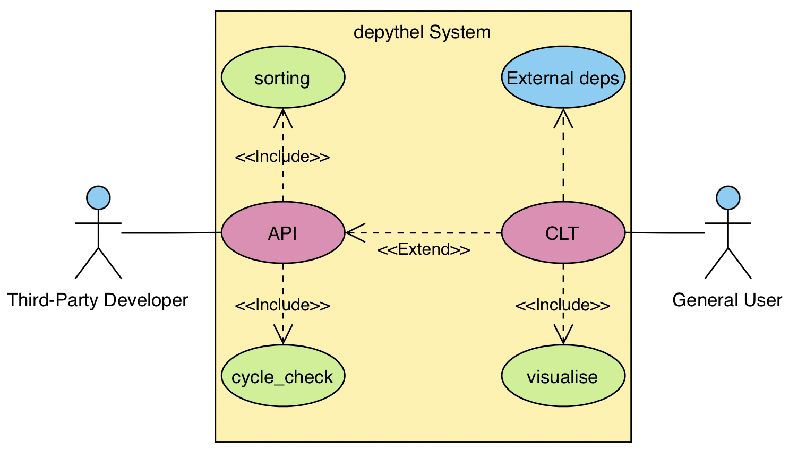

   Use Case Diagram for depythel

   A general user can use the Command Line Tool, which should provide an easy-to-use frontend for working with depythel.

   Third-party developers, who might want to extend the functionality of depythel further, can make use of an API.
   The benefits of the API include having no external dependencies, as well as being type-checked and documented.

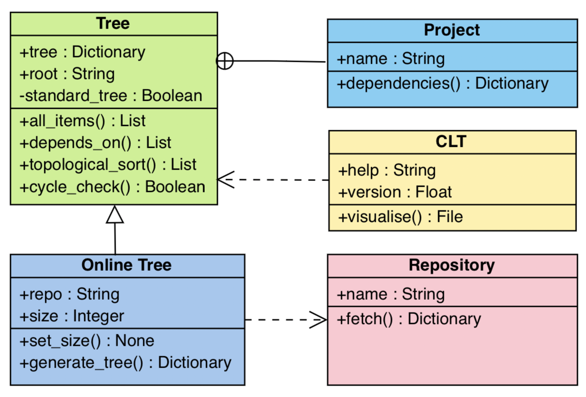

   UML Class Diagram for depythel

   A base ``Tree`` class will support locally-generated trees. It will split a dictionary
   representing an adjacecncy list into ``Projects``.

   An online tree class will extend this class by adding support for online repositories.

   The CLT will use the Tree class as a basis for performing tree operations.

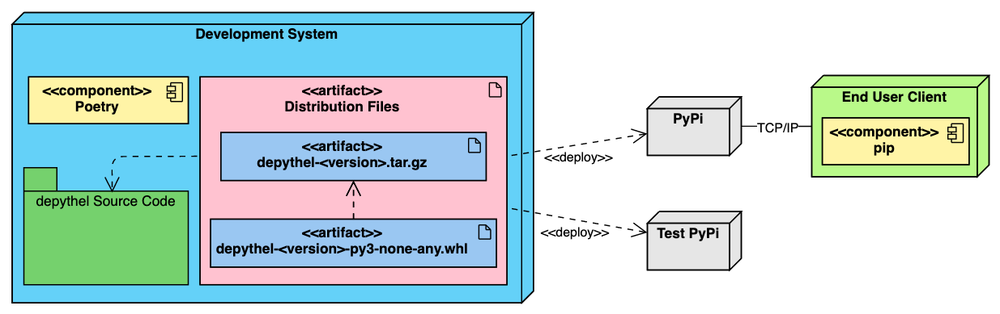

   Deployment of depythel to PyPi

   Distribution files in the form of source code and `wheels <https://pythonwheels.com/>`_ will be generated via poetry.

   These will be uploaded to `Test PyPi <https://test.pypi.org/>`_ first to ensure everything has worked, and then `PyPi <https://pypi.org/>`_.

   The modules can then be accessed by the clients via ``pip``.

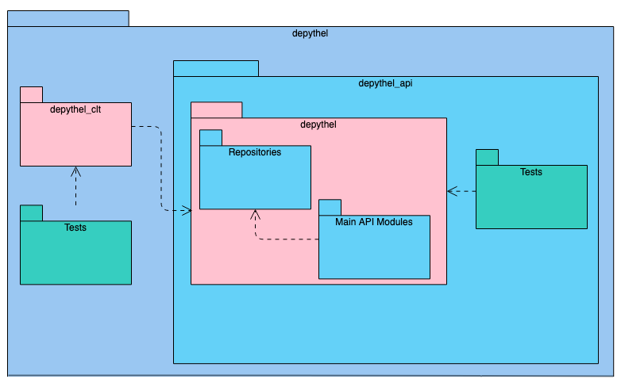

   depythel File Structure

   The overall depythel folder indicates the git directory, and the arrows indicate which folders depend on what.

   The directories in pink indicate the python modules that can be imported and what will be distributed via PyPi.

High Level Overview
-----------------------------------------------------------------------------------------------------------------------

+------------------------------+-------------------------------------------------------------+-----------------------------------+----------------------------+
| Inputs                       | Processes                                                   | Storage                           | Outputs                    |
+==============================+=============================================================+===================================+============================+
| Dependency Name              | Build and Traverse Dependency Tree                          | Some form of client-based caching | Interactive visualisation  |
+------------------------------+-------------------------------------------------------------+-----------------------------------+----------------------------+
| Package Manager              | Detect Cycles in the Tree                                   |                                   | Text/JSON based API output |
+------------------------------+-------------------------------------------------------------+-----------------------------------+----------------------------+
| Number of levels to traverse | Visualising the Tree                                        |                                   |                            |
+------------------------------+-------------------------------------------------------------+-----------------------------------+----------------------------+
|                              | Other user API processes (e.g. determine topological order) |                                   |                            |
+------------------------------+-------------------------------------------------------------+-----------------------------------+----------------------------+

Please see the :ref:`API Reference` for a more detailed code-based overview of the project.

Description of Data Structures
-----------------------------------------------------------------------------------------------------------------------

***********************************************************************************************************************
Dependency Tree Graph
***********************************************************************************************************************

A dependency tree is required to store what projects each program depends on. At first, an adjacency graph was
considered since it is very easy to implement and it represents directed graphs well.

However, an adjacency list is likely to be better suited since the dependency graph is likely to be quite sparse, and
so a list will provide a better space complexity. It's also easy to build depending on the repository's API, and
can be implemented natively as a dictionary.

***********************************************************************************************************************
Priority Queue
***********************************************************************************************************************

A data structure is required to store the dependencies that need to be added to the tree. One potential way of doing
this would be a priority queue system. This is able to prioritise dependencies based on how far down it is in the tree.

The dependencies should be added in level order. This method is used by the majority of existing implementations, and
allows the user to have a more broad understanding of a project's dependencies.

Standard Queue: ``[A, A.deps(), B, B.deps(), C, C.deps(), etc.]``

Priority Queue: ``[A, B, C, ..., A.deps(), B.deps(), C.deps(), ...]``

From an implementation point of view, if a project depends on A and B, the children of these dependencies should be added
afterwards.

..
    TODO: IT MIGHT BE WORTH PUTTING DEQUE

Description of Algorithms
-----------------------------------------------------------------------------------------------------------------------

***********************************************************************************************************************
Breadth-First
***********************************************************************************************************************

Since dependency trees can be extremely large, the user will be able to enter how far down the tree they want to generate. So as to
implement this level functionality, the tree/priority queue will be built using a breadth-first approach.

Breadth-first traversal is chosen over depth-first since the users are interested in the dependencies of the root project.
They are less likely to be interested in the dependencies of dependencies.

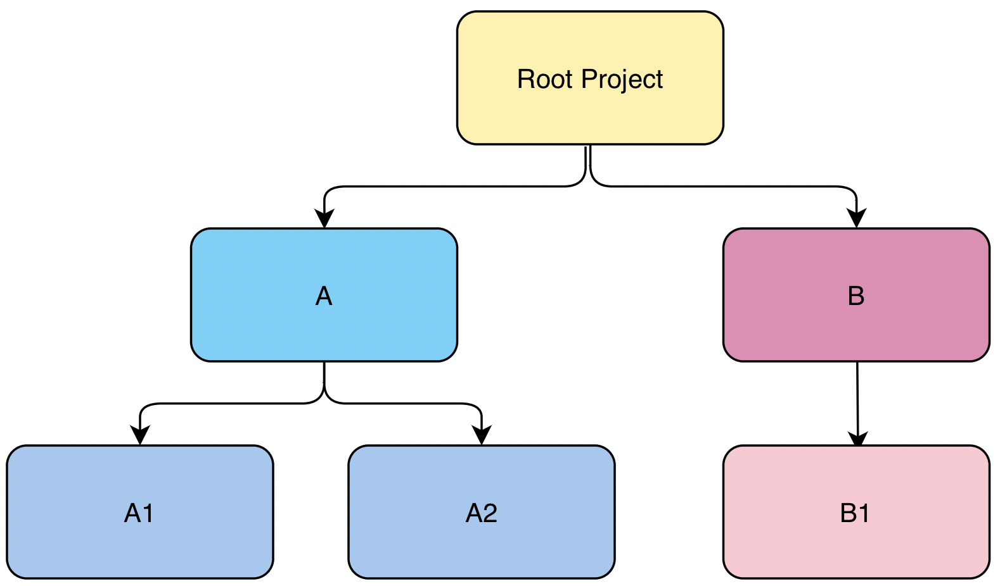

   An example dependency tree graph for a project

   Using a breadth-first approach, when the tree is being represented in JSON/text, the order should be
   ``root → A → B → A1 → A2 → B1``.

***********************************************************************************************************************
Topological Ordering
***********************************************************************************************************************

Dependency trees at their core are used to determine the order to install projects. For instance, to make a cake
requires an egg, which requires a chicken. The chicken can't come before the egg. (The chicken came first of course)

In the same way, some dependencies need to be installed before others can, similar to the critical path flowchart for
what tasks need to be completed before others.

The basic premise of the algorithm is to continually pop projects from the tree that don't have any dependencies. If this is not
possible at any point during execution, this means that a cycle is present and so no topological sorting is possible.

Cycles are the main cause of no topological sorting being possible.
As an example, if A → B → A, which dependency do you install first? Therefore, in this scenario, the module should error.

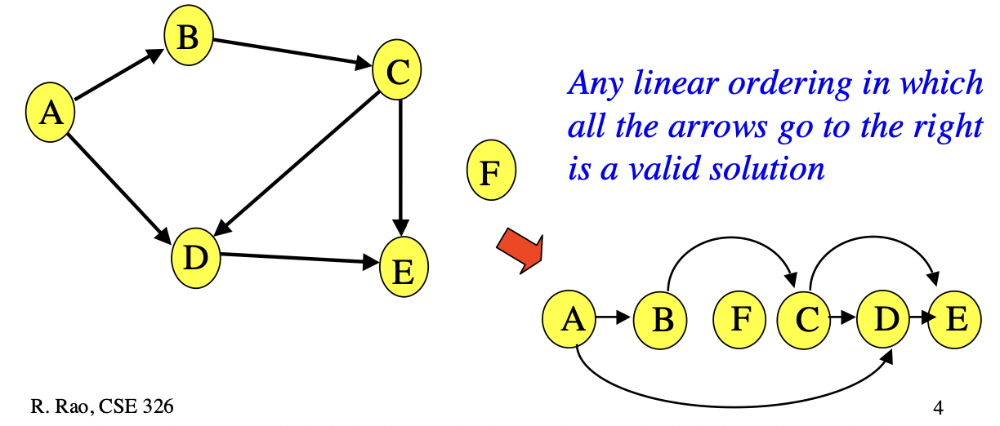

    Topological Sorting Possible

    Given a valid dependency tree, a valid topological sorting should be generated.

    *Rao, R., 2003. Lecture 20: Topo-Sort and Dijkstra’s Greedy Idea.*

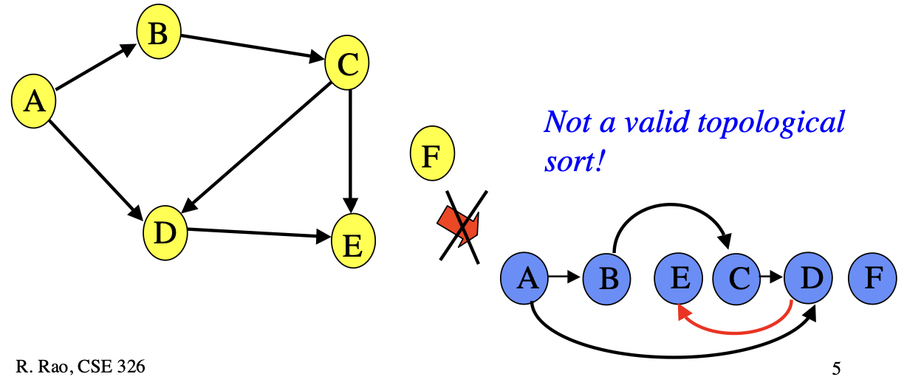

    No Topological Sorting Possible

    The tree is invalid since there's a cycle present.

    *Rao, R., 2003. Lecture 20: Topo-Sort and Dijkstra’s Greedy Idea.*

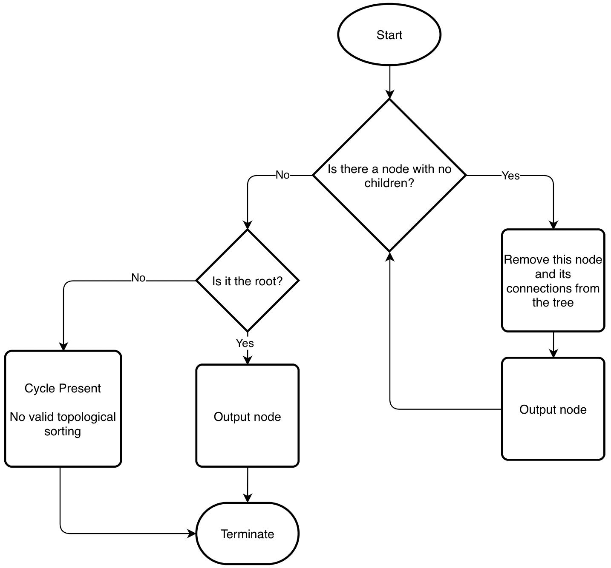

    Intended functionality of depythel topological sorting.

    Algorithm based on *Rao, R., 2003. Lecture 20: Topo-Sort and Dijkstra’s Greedy Idea.*

***********************************************************************************************************************
Cyclic-Dependency Checking
***********************************************************************************************************************

To detect cycles, we can mark certain
nodes as *visited* if we have visited all of their children, and *exploring* if it's on our current path. Whilst
traversing, if we reach an *exploring* node, that means we have reached an earlier point on our trail and we have a
cycle.

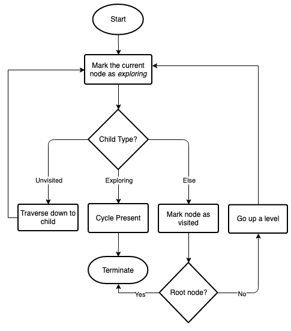

   Flowchart demonstrating the intended functionality of the cyclic dependency algorithm.

    Algorithm based on *Khov, T., 2020. Algorithms on Graphs: Directed Graphs and Cycle Detection. [online] Medium. Available at: <https://trykv.medium.com/algorithms-on-graphs-directed-graphs-and-cycle-detection-3982dfbd11f5> [Accessed 22 March 2022].*

Cycle checking can be implemented whilst generating the tree, which means that the tree doesn't have to be parsed
again when checking for cycles. Alternatively, this process could be implemented as a separate module so that the user
can run it when they want.

Codebase Design
-----------------------------------------------------------------------------------------------------------------------

For each package repository, there should be the option to retrieve the dependencies from an online API.
By implementing this in a modular fashion, this should make it easier to support different package managers.

***********************************************************************************************************************
Static typing
***********************************************************************************************************************

Python is a dynamically typed language. This allows for fast development cycles and more concise code. However,
for large projects such as an NEA, static typing might be seen as preferable since it can help catch mistakes
and allows for better autocomplete.

Type hints in Python aim to take the middle ground.

.. code-block:: python

  # No type hints
  def odd(number):
    """Determines whether a number is odd."""
    return f"Your number was {number}"

  # Type hints
  def odd(number: int) -> str:
    """Determines whether a number is odd."""
    return f"Your number was {number}"

Type hints can be checked during development using type checkers (such as `mypy <http://mypy-lang.org>`_), whilst
still allowing for concise Python code. To still allow for dynamic typing, the types aren't in effect during runtime. For example, if a boolean was put as ``number``, this wouldn't
cause an error.

As a form of data validation, it might however be useful for it to cause an error in this scenario. This is where
``beartype`` comes in.

***********************************************************************************************************************
Data Validation
***********************************************************************************************************************

Within the CLT, `Beartype <https://github.com/beartype/beartype>`_ has been chosen to help validate user inputs. It works
on the basis of comparing the user's input to the type hint of the parameters.

.. code-block:: python

    from beartype import beartype

    @beartype
    def output(word: str):
        print(f"The word you entered was {word}")

    output('hello')
    # The word you entered was hello
    output(3)
    # raises BeartypeCallHintParamViolation

This library in particular has been chosen over other data validation libraries for the following reasons:[2]_

* It provides O(1) runtime type checking.
* It has no runtime dependencies.
* It allows defining custom types, such as an integer that has to be exactly two to six digits long.

As such, it should provide more than enough functionality so that a user does not accidentally break a function
depending on their input.

.. [2] Curry, C., 2022. beartype/README.rst at main · beartype/beartype. [online] GitHub. Available at: <https://github.com/beartype/beartype/blob/main/README.rst> [Accessed 22 March 2022].

***********************************************************************************************************************
Fetching Dependencies
***********************************************************************************************************************

If the package manager provides an online API, the dependencies can be retrieved via the ``requests`` package (or something similar).

Benefits:

* It does not require that the user has installed the package manager locally. This therefore leads to greater
  OS/machine independency.
* The API should be the more up-to-date that local installation records, and so the dependency graph is more likely to
  be correct.
* Fewer security concerns since we are not interacting with the user's package manager.

Originally, it was thought that fetching dependencies from a file, such as ``setup.py`` would be a nice feature to have.
The following reasons were thought of:

Benefits:

* In some scenarios (dependending on the implementation), this should be quicker than the online approach since
  everything is done locally.
* Internet access is not required.
* Increased reproducibility.

However, as part of the design, fetching via the internet was chosen in preference to this method for the following
reasons.

Downsides:

* This process can be non-deterministic. As an example, depythel wouldn't be able to tell what dependencies are present given this
  ``setup.py``:[1]_

.. code-block:: python

    # Written by Dustin Ingram 2018
    import random
    from setuptools import setup

    dependency = random.choice(['Schrodinger', 'Cat'])

    setup(
        name='paradox',
        version='0.0.1',
        description='A nondeterministic package',
        install_requires=[dependency],
    )

* With the exception of lock files, the dependencies of dependencies would have to be fetched online anyway, which defeats
  the purpose of not using the internet.

.. [1] Ingram, D., 2018. Why PyPI Doesn't Know Your Projects Dependencies - Dustin Ingram. [online] dustingram.com. Available at: <https://dustingram.com/articles/2018/03/05/why-pypi-doesnt-know-dependencies/> [Accessed 22 March 2022].

Design of User Interface
-----------------------------------------------------------------------------------------------------------------------

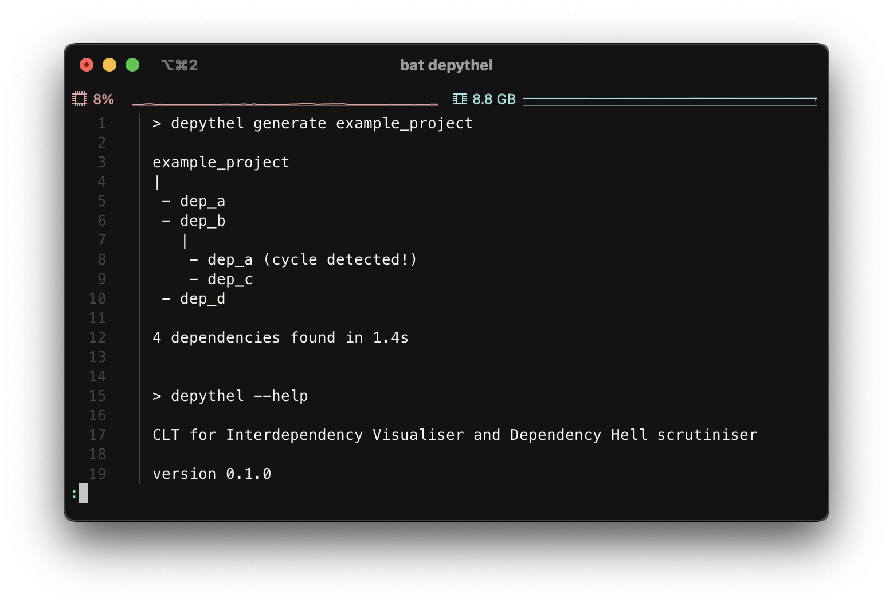

   Mockup of the depythel CLT

   It will provide some visual output to display a dependency tree, and it should also be able to
   detect cycles.

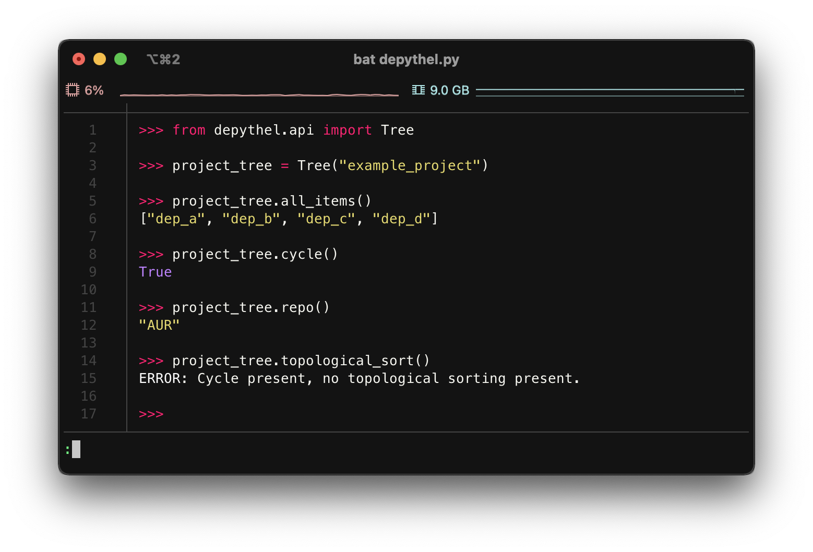

   Mockup of the depythel API

   This will be accessed via Python, and it should provide a similar functionality to the CLT.

***********************************************************************************************************************
Command Line Interface
***********************************************************************************************************************

As discussed in the :ref:`Analysis`, although the depythel API is the main priority, it would also be useful to provide
some form of a command line interface. Preferably, `typer <https://github.com/tiangolo/typer>`_ would have been used
as the framework to provide this. This is since depythel takes `PEP 561 <https://www.python.org/dev/peps/pep-0561/>`_ compatability very
seriously, and typer provides many additional benefits for doing so.

However, as of the time of writing, it seems to be unmaintained. Therefore, `click
<https://palletsprojects.com/p/click/>`_ has been chosen instead for the following reasons:

* It generates help page documentation automatically.
* Integrates very well with `rich <https://rich.readthedocs.io/en/stable/introduction.html>`_, which can allow for
  improved formatting of the user interface.
* Very readable, well documented, and easy-to-use.

The ``rich`` library mentioned above can be used to provide a more colourful and presentable appearance. It allows
customising colours and supports basic markup.

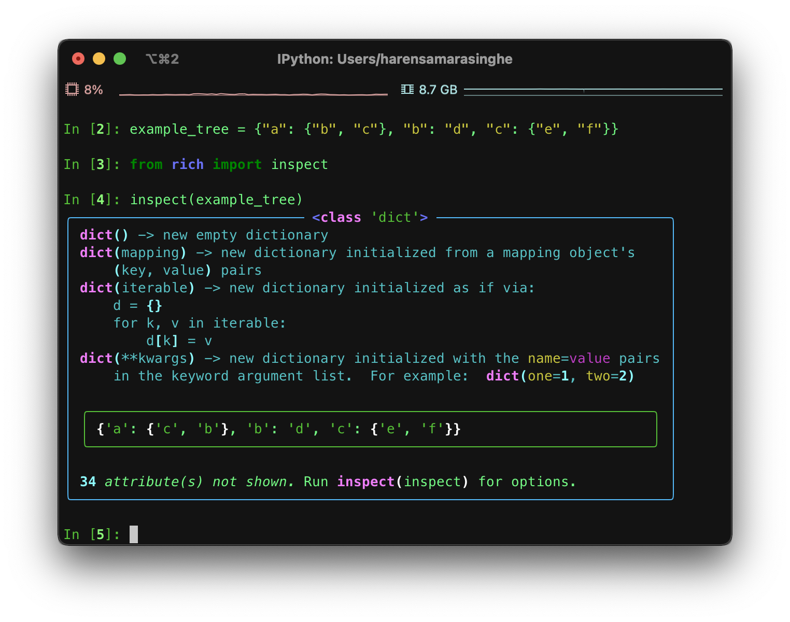

    The ``rich`` library "visualising" a simple dictionary representing a dependency graph.

    This library can be used in formatting the visualisation output in the command line tool.

System Security and Integrity of Data
-----------------------------------------------------------------------------------------------------------------------

Dependency trees are used in deciding what projects to install when building a program, and a third-party developer
can use the modules provided by depythel to assist in this process.

However, a hostile actor could potentially tamper with the tree so that the user installs a malicious program without realising.
Most projects normally have very large dependency trees, making it even easier to tamper with without detection.

***********************************************************************************************************************
Data Attack Surface Reduction
***********************************************************************************************************************

The API will take the approach of not writing any dependency tree to the disk. If there is no dependency tree present,
it can't be tampered with. depythel will take a more just-in-time approach, and will only fetch the tree as soon as it is required.
Any operations on the tree will be carried out at runtime, minimising the time slot for it to be tampered with.

For the command line tool, it is unlikely that it will be used in a high security environment since it is tailored to more
novice users. As such, this security policy will only be enforced for the API

***********************************************************************************************************************
Checksums
***********************************************************************************************************************

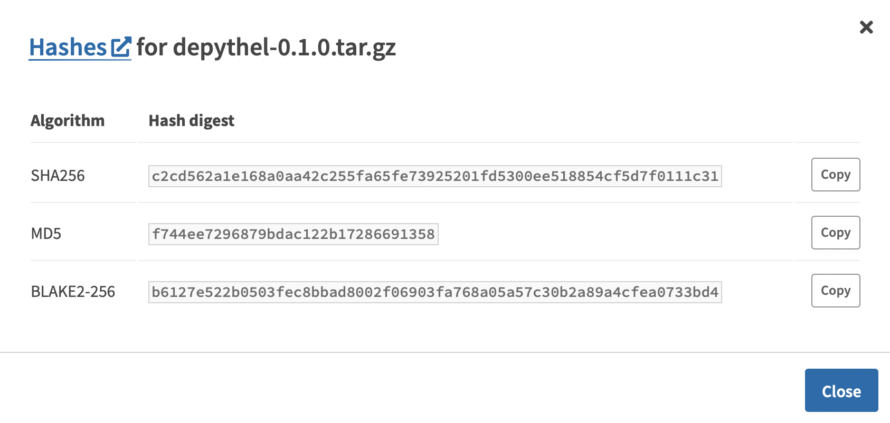
   
   Three different hashes are provided for every version distributed via PyPi.

The recommended method of installation for the majority of users will be from PyPi. Checksums are provided so that clients
can check whether the source code they have downloaded is the same as that on PyPi.

Checksums are also very simple to calculate. This therefore allows even more
novice users to ensure that the files haven't been corrupted whilst downloading.

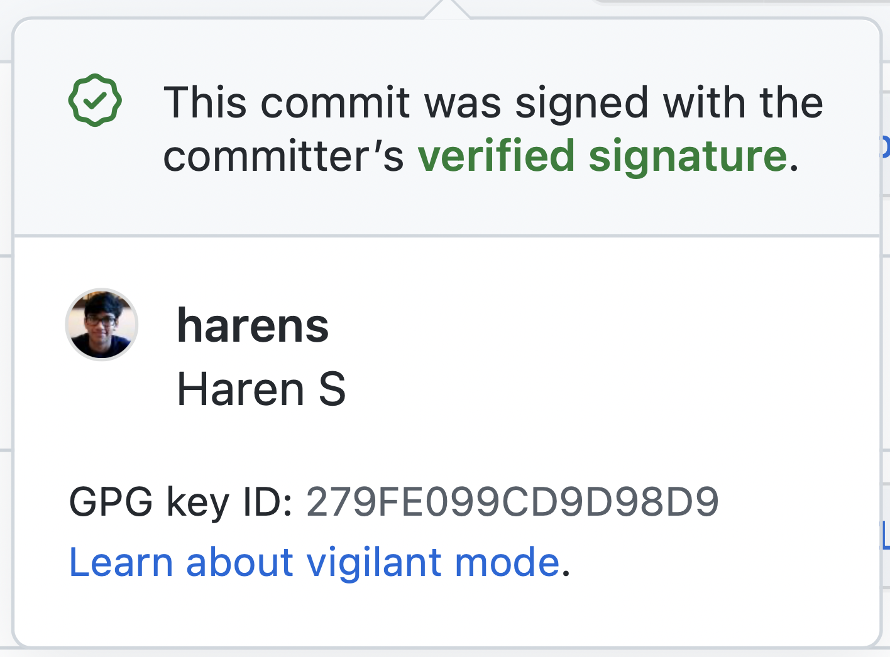

Signing Commits
***********************************************************************************************************************

Every commit that is pushed to GitHub will be signed by my private key. This helps to ensure that the code hasn't been tampered
with during transmission from my development environment to the online repo. Therefore, users can be confident that the
code hasn't been interfered with by a malicious actor.

GitHub has access to my public key. Whenever I push a commit, GitHub can therefore inform users whether the commit is
"verified" or not.
