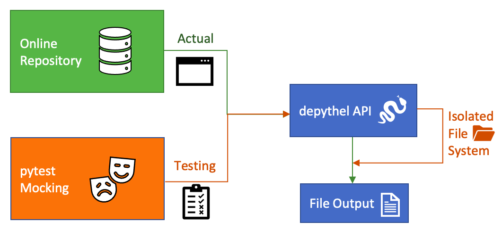

Testing
~~~~~~~~~~~~~~~~~~~~~~~~~~~~~~~~~~~~~~~~~~~~~~~~~~~~~~~~~~~~~~~~~~~~~~~~~~~~~~~~~~~~~~~~~~~~~~~~~~~~~~~~~~~~~~~~~~~~~~~

Some of the reasons unit testing was chosen include [1]_:

- If code needs to be refactored, the tests can be reused.
- It's easy to test newly developed modules or functions.
- There are some really easy-to-use unit testing frameworks for Python, such as pytest.

pytest
-----------------------------------------------------------------------------------------------------------------------

.. figure:: https://docs.pytest.org/en/latest/_static/pytest_logo_curves.svg
  :align: right
  :width: 100

`pytest <https://docs.pytest.org/en/7.1.x/>`_ was chosen for testing due to its readablity and the `wide variety of plugins <https://docs.pytest.org/en/7.0.x/reference/plugin_list.html>`_ that are available.

It provided an easy-to-use framework to write unit tests via simple `assert` statements.

An example test is given below, where we assert that a cycle is present in a given graph.

.. code-block:: python

  def test_standard_cycle(self) -> None:
      """Simple cycle a --> b and b --> a"""
      cycle_present = LocalTree({"a": "b", "b": "a"})
      assert cycle_present.cycle_check()

Reproducible Testing
-----------------------------------------------------------------------------------------------------------------------

Testing should ideally be reproducible. It shouldn't matter which supported python version is being used, or whether
internet access is available or not. If the code is valid and works as expected, the tests should pass.

Mocking API Calls
***********************************************************************************************************************

As part of retrieving dependencies from the online repositories, a series of API requests are made.
During testing, the results of these requests are mocked for a series of reasons.

If the API calls aren't mocked:

- The tests will fail if there's no internet access.
- If the upstream API result changes, the tests will fail.
    - The tests might pass today and fail tomorrow.
    - An example of this that happened during development was when `gping <https://ports.macports.org/port/gping/details/>`_'s
      clang dependency in MacPorts was bumped from ``clang-12`` to ``clang-13``.

But most importantly, we are only testing how the modules react for some given API results. A series of fake results
can be used to test a variety of different scenarios.

An example of how this mocking is done is provided below:

.. code-block:: python

        def test_grow_shrink(self, session_mocker: MockFixture) -> None:
            """Grow a tree and then shrink it."""
            session_mocker.patch(
                "depythel.repository.homebrew.online",
                side_effect=(
                    {"rust": "build_dependencies"},
                    {"libssh2": "dependencies", "openssl@1.1": "dependencies"},
                ),
            )

            gping_tree = Tree("gping", "homebrew")
            gping_tree.set_size(2)
            assert gping_tree.tree == {
                "gping": {"rust": "build_dependencies"},
                "rust": {"libssh2": "dependencies", "openssl@1.1": "dependencies"},
            }
            gping_tree.set_size(1)
            assert gping_tree.tree == {"gping": {"rust": "build_dependencies"}}

Here, the `depythel.repository.homebrew.online` module is mocked. Normally, it would fetch information
from the Homebrew package manager. Instead, the result of the function is mocked to prevent the API call being made.

Isolated File System
***********************************************************************************************************************

The ``visualise`` subcommand generates an HTML file. To test for its existence, an isolated file system is created.

.. code-block:: python

    def test_visualise(tmp_path: pathlib.Path, session_mocker: MockFixture) -> None:
        """Checks for the existence of an html file following the visualisation command."""
        runner = CliRunner()

        # Don't show the path of the temporary file in the file explorer.
        session_mocker.patch(
            "depythel_clt.main.click.launch",
            return_value=None,
        )

        with runner.isolated_filesystem(temp_dir=tmp_path) as directory:
            result = runner.invoke(
                depythel, ["visualise", f"{directory}/tree.html", "{'a': 'b'}"]
            )
            assert result.exit_code == 0
            assert os.path.exists(f"{directory}/tree.html")

The benefits of the temporary directory include allowing the user's system not
to be affected by the test. Vice versa, it also means that the test isn't affected
by the user's system.

---

To help make testing more reproducible, a GitHub Actions process was setup to test on a variety of different
environments.

GitHub Actions
-----------------------------------------------------------------------------------------------------------------------

GitHub Actions provides the facilities to test on a variety of different python versions, whilst allowing
others to inspect the results of testing.

The YAML file used to control this process is shown below:

.. code-block:: yaml

    # Based off https://github.com/Electrostatics/mmcif_pdbx/blob/master/.github/workflows/python-package.yml
    # Also credit to https://github.com/commitizen-tools/commitizen/tree/master/.github/workflows

    name: Tests
    on: [push, pull_request]

    jobs:

      build:
        runs-on: ubuntu-latest
        strategy:
          matrix:
            python-version: ['3.7', '3.8', '3.9', '3.10']
            test-area: [pytest, type-checking, dependencies, lint]
            exclude:  # Dependencies and lint on 3.10, type-check and pytest all,
              - python-version: 3.7
                test-area: dependencies
              - python-version: 3.8
                test-area: dependencies
              - python-version: 3.9
                test-area: dependencies
              - python-version: 3.7
                test-area: lint
              - python-version: 3.8
                test-area: lint
              - python-version: 3.9
                test-area: lint
        steps:
        - uses: actions/checkout@v1
        - name: Set up Python ${{ matrix.python-version }}
          uses: actions/setup-python@v2
          with:
            python-version: ${{ matrix.python-version }}
        - name: Install dependencies
          run: |
            python -m pip install -U pip relaxed-poetry
            make install-${{ matrix.test-area }}
            rp --version
            rp install
        - name: Test ${{ matrix.test-area }}
          run: make ${{ matrix.test-area }}
        - name: Upload coverage to Codecov  # Only required for pytest
          if: matrix.test-area == 'pytest'
          uses: codecov/codecov-action@v1.1.1
          with:
            token: ${{ secrets.CODECOV_TOKEN }}
            file: ./coverage.xml
            fail_ci_if_error: true

The process can be broken down into the following steps:

* Set up an ubuntu virtual machine.
* Specify the Python version to install depending on what task is being performed.
    * Check dependencies and perform linting on Python 3.10.
    * Perform type checking and run pytest on all supported Python versions (3.7+).
* Checkout the git repo and install the relevant dependencies based on the task being run.
* Run the tests.
* Upload code coverage if pytest is being run.

Test Coverage
-----------------------------------------------------------------------------------------------------------------------
.. image:: https://codecov.io/gh/harens/depythel/branch/main/graph/badge.svg?token=Jb2Dnbwuf4
    :target: https://codecov.io/gh/harens/depythel

Unit tests are useful in ensuring that a program works as anticipated. However,
it is also necessary that the tests cover a large amount of the code base for them to
be effective

Code coverage provides a numerical value that shows what percentage of the code base has been
tested. This is determined whilst the tests are being run, by seeing which lines are called.

|pytest-terminal|

Whilst the GitHub actions are being run, a ``coverage.xml`` is generated. This file uploaded to `Codecov <https://about.codecov.io/>`_.

Codecov was chosen to manage the code coverage due to its `easy integration <https://github.com/marketplace/actions/codecov>`_ with GitHub Actions. It also supports
private GitHub repos.

If the code coverage decreases following a commit, the tests are set to fail. This helps to ensure
that new code additons are throughly tested before being commited.

One of the key aims before starting the project was to have a test coverage of >90%. As of the time of writing,
~96% of the code is tested, which is above the target.

.. [1] tutorialspoint. 2021. Unit Testing. [online] Available at: <https://www.tutorialspoint.com/software_testing_dictionary/unit_testing.htm> [Accessed 14 March 2022].

